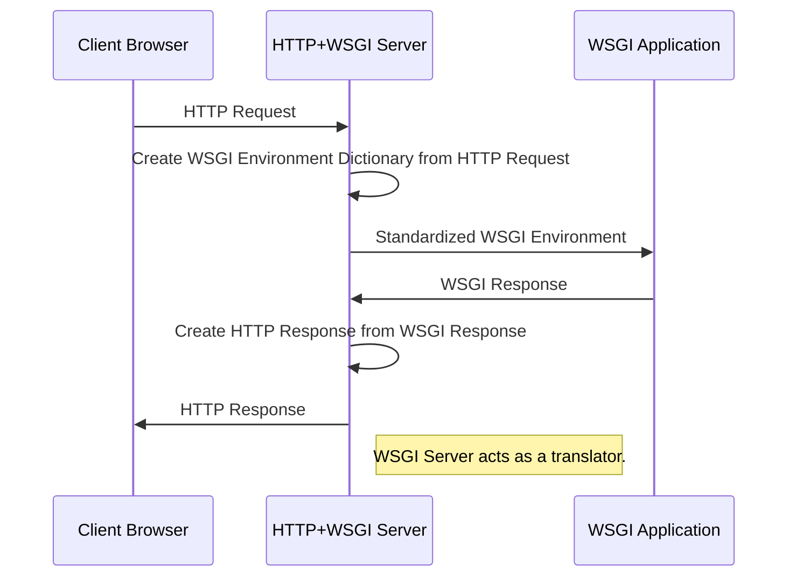

# Python WSGI versus ASGI

## Overview

Back in the day, when ASGI isn't a thing and asynchronous supports inside Python language itself are half-baked, Python web frameworks are synchronous and built around WSGI specification (e.g. `django`, `flask`, ...). They are called _pure-WSGI web frameworks_. Their asynchronous implementation (e.g. Flask 2.0 `flask[async]`) are somewhat limited: they start a temporary event loop per-request, put it inside a worker (or thread), run the async view inside it, then shut it down after the view functions returned.

=> The event loop is short-lived and local to the request. A request-scoped event loop only allows multiple async operations WITHIN A SINGLE REQUEST to run concurrently. `await` pipeline where one's output is another's input is nuisance, it's similar to synchronous operations, yet with event loop overhead. It DOES NOT enable handling async operations across DIFFERENT REQUESTS.

=> If you need to crawl multiple URLs at once, read multiple files at once, send multiple DB queries at once, use async.

Time goes by, Python engineers have developed a deep understanding of asynchronous programming over the years, Python has finally stabilized their native `asyncio` library to fully adopt the ASGI specification: event loop is initialized globally to the application context and stay alive during the application lifespan, it's shared between requests and persisted after sending response. True ASGI functaionalities: persistent background tasks/jobs, HTTP streaming, WebSockets, server-sent events...

_Pure-ASGI web frameworks_, Python web frameworks that adopt ASGI specification in design have emerged (e.g., `FastAPI`, `Sanic`, etc.). These frameworks are significantly more efficient at handling asynchronous operations than _pure-WSGI web frameworks_.

Keep in mind, that web frameworks are composed of many libraries, each covering different functional aspects. Performance-related concerns for these functionalities are often delegated to an "application server" — a specialized server designed to run Python applications with optimized performance. Technically specking, they do so by running multiple instances of the applications, each occupy inside a process inside the OS, communicating with the web servers to distribute multiple incoming requests to those instances and make sure they're healthy, even restart them as needed.

There are also 2 types of application server:

- Pure-WSGI servers include `uWSGI`, `gunicorn`, `meinheld` with async support from worker class like `greenlet`-based libraries `gevent` and `eventlet` (provide concurrency to pure-WSGI but they're not ASGI). These server are designed for pure-WSGI web frameworks. One exception is that `gunicorn` has a worker class called `uvicorn.workers.UvicornWorker` which allowed itself to be plugged into Pure-ASGI web frameworks.
- Pure-ASGI server: `uvicorn`, `hypercorn`, `daphne`. Thse servers are meant to plugged into pure-ASGI web framework.

**NOTE:** Pure-ASGI server can handle synchronous view functions, just not very optimized since the synchronous view functions are run inside the event loop, yet the event loop has too much on its plate already (check for the readiness of various events, manage asynchronous tasks, ...) which add unnecessary latency.

## Web Service Gateway Interface (WSGI)

It's a standard, an interface specification that defined how HTTP Server can interact with a Python application running inside a Application Server. The web servers that's built with this specification is called **WSGI servers**

WSGI is the name of the interface specification for Python. There are counterparts in different languages, such as **Ruby Rack** or **Java Servlets**.

### History

**HTTP Server:** Apache `httpd` or Nginx are generally termed "web servers", but more specifically, they're called "HTTP servers":

- Run on port 80 and handle static files efficiently
- Don't know how to communicate with Python application.

**Application Server:** Specialized server than can run Python application with performance optimization:

- Keep Python interpreter in memory so that it does not need to be restarted on each request.
- Can start multiple processes and handle multi-threading.
- Can't run on port 80 and not good at handle static files.

---

This was the flow of a HTTP Request/Response using Apache web server before WSGI specification (the same could apply to `nginx`):

```
Apache httpd (HTTP Server) <-> mod_proxy <=> Application Server <=> Python application
```

The request is received by HTTP server, proxied to Application Server, then Application Server engages the Python application. The Python application outputs response, it get proxied back to HTTP server.

Back then, the Application Server wasn't standardized. People finally settled on WSGI specification that defined how WSGI (Application) Server should interact with WSGI (Python) application. Since then, Python web frameworks have focused on creating different WSGI applications so they can be managed by different WSGI servers.

### Components

WSGI standard is used to build 2 components: WSGI _server_ and WSGI \_application. They depends on each other: WSGI server converts HTTP request to standardized WSGI environment, WSGI application received the environment and return a WSGI response, and then WSGI server converts the WSGI resposne to HTTP response.




### TWO categories of WSGI servers

WSGI servers can be classified into two categories: **integrated WSGI+HTTP servers** and **Standalone WSGI servers**:

- **Integrated WSGI+HTTP servers**: specialized servers that directly involve into request handling without proxying. They are optimized for development environment and should NOT be used in production environment.

> E.g. [Flask's Werkzeug](https://stackoverflow.com/a/50153051/9122512) is a single-threaded server. If one people is currently waiting for a 20-seconds SQL query to complete, other users connecting to the server will be blocked.

- **Standalone WSGI servers**: servers that are optimized for production environments and typically operate behind high-performance C-implemented HTTP servers that act as reverse proxies to ensure security, efficiency, [stability and reliability](https://www.linkedin.com/posts/hany-mostafa-064b552a_stability-reliability-and-resilience-are-activity-7129592089469722624-q83y). They will need to be put behind a dedicated HTTP servers such as Nginx.

> The stack I often seen is **uWSGI + nginx**.

Technically, these servers use a multi-process design: they load the application once, then create several worker processes to handle requests at the same time. Some servers also support multi-threaded capabilities inside each worker, but this means your application code must be thread-safe. Most setups use multiple processes because it's simpler and keeps each worker isolated from others.

### List of most common WSGI servers

- Werkzeug - Flask's built-in WSGI+HTTP server.
- Gunicorn - pure, production-grade Python WSGI server.
- Waitress - pure Python WSGI server.
- uWSGI - production-grade server suite.
- mod_wsgi - WSGI server integrated with Apache httpd server.

> NOTE: When hosting Flask application, you will need to [tell Flask it is behind a Proxy](https://flask.palletsprojects.com/en/stable/deploying/proxy_fix/).

## Asynchronous Service Gateway Interface (ASGI)

<!-- TODO: fill this in the future -->

## References

- [WSGI's Documentation](https://wsgi.readthedocs.io/en/latest/index.html)
- [Full Stack Python's "WSGI"](https://www.fullstackpython.com/wsgi-servers.html)
- [Flask Official Documentation "Deploying to Production"](https://flask.palletsprojects.com/en/stable/deploying/)
- [zo0M's answer on SOF, 2022-05-20](https://stackoverflow.com/a/71546833/9122512)
